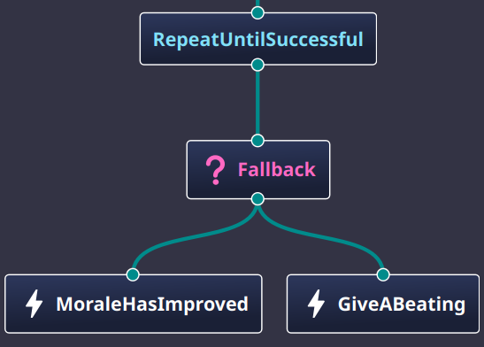
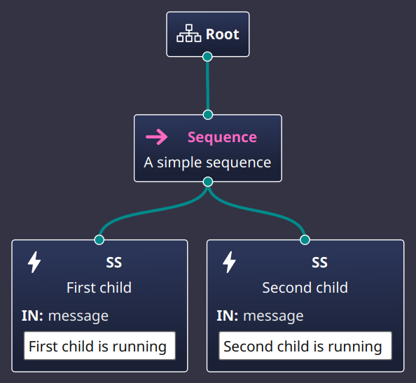

# A Brief Introduction to Behavior Trees

ROS 2 provides a powerful tool for controlling the movement and behavior of robots: the ***Behavior Tree***.
They are simple XML files that you can create which can then be used to execute complex behaviors for the robot.
Look at this simple, hypothetical example of a behavior tree:

```xml
  <BehaviorTree ID="MainTree">
    <RetryUntilSuccessful num_attempts="3000000000">
      <Fallback>
        <MoraleHasImproved/>
        <GiveABeating/>
      </Fallback>
    </RetryUntilSuccessful>
  </BehaviorTree>
```

This behavior tree will keep beating the robot until its morale has improved.

You can also visualize the behavior tree in a graphical way, like this:

<figure style="text-align: center;" markdown="1">
  <a name="fig:beatings_will_continue"></a>
  
  <figcaption>The beatings will continue until morale improves</figcaption>
</figure>

To make the the discussion a bit easier to read, I will often shorten the term ***behavior tree*** to ***BT*** from now on.

## What is a Behavior Tree?

First, some vocabulary.
A BT is composed of `nodes`. Graphically, think of nodes as the boxes in the [picture](#fig:beatings_will_continue) above.
Nodes are connected to each other in a `parent` to `child` relationship, represented by the lines connecting the boxes in the picture.
Every node but one has exactly one parent and may have none, one, or multiple children.
Only one node in the tree has no parent, and that node is called the `root` node.
Nodes which have no children are called `leaf` nodes.

There are four general categories of nodes that can be used in a behavior tree:

* `Action` nodes usually cause things to happen. Action nodes are leaf nodes.
   Examples of action nodes might be: `MoveForward`, `FollowPath`, or `GoToDock`.
* `Condition` nodes define a test that must be met. Condition nodes are leaf nodes.
  Examples of condition nodes might be: `IsBatteryLow`, `IsDistanceTravelledGreaterThan`, or `IsRobotAtDock`.
* `Control` nodes govern the flow of execution.
  Examples of control nodes might be:
  * `Fallback` The child nodes are a sequence of behaviors that are tried in order until one succeeds.
  * `RecoveryNode` Will try to recover from failure of the first child node by executing the second child node.
  * `Sequence` Performs the behavior of the child nodes in order.
* `Decorator` nodes modify the behavior of the child node.
  Examples of decorator nodes might be:
  * `RateController` Limits the frequency at which the child node is executed.
  * `SingleTrigger` Ensures that the child node is only executed once.
  * `Inverter` Inverts the ***Success*** / ***Failure*** status of the child node.

Every node in the tree is backed by a piece of code.
There are a set of general nodes provided by the BT library, and additional, navigation specific nodes
provided by the `nav2` package, but you can also create your own nodes.
To create your own nodes, you will need to write your own code to implement the behavior of the node,
following rules for class inheritance and use some macros to register the node with the BT library.

## How Does a Behavior Tree Work?

A node represents some kind of behavior. A node performs its behavior when it receives a signal called `tick`.
Every time a node gets ticked, it should respond quickly with one of three states: `SUCCESS`, `FAILURE`, or `RUNNING`.
Well, some nodes are not allowed to return all of those states, but we will get to that later.

When a BT is started, the root node is ticked.
All nodes, when ticked, decide what to do with regards to the child nodes they have, if any.
Leaf nodes will just do their thing and return a state to their parent node.
Control and decorator nodes will tick their child nodes in some order and then decide what to do with the states of the child nodes.
Eventually, some path of nodes in the tree results in some state being returned to the root node and
the root node returns that state as the result of the tick.
If the root node ends up returning ***RUNNING***, it will be ticked again, and the whole process will repeat until
the root node returns ***SUCCESS*** or ***FAILURE***.

All the nodes that get ticked are supposed to return a state quickly so that the BT can get ticked again, over and over, until
the BT has reached some sort of conclusion.
It's not unusual for the root node to be ticked a hundred times a second or faster.
This fast ticking is necessary to keep the robot responsive to changes in the environment.

As an example, a hypothetical `MoveForward` Action node, which is likely to take a bit of time to actually move the robot,
would return ***RUNNING*** when it was first ticked.
It might continue returning ***RUNNING*** on subsequent ticks until it  finally reaches the intended pose,
then it will return ***SUCCESS*** to indicate that the node completed its behavior.
If a node finds it cannot complete its designed behavior, it should return ***FAILURE***.
`MoveForward` might fail if the robot runs out of battery power, or if the
wheels keep slipping and the robot doesn't seem to actually move forward, you get the idea.

## A Simple Example of Node Tick and Response

In the following example we have two kinds of nodes:

* `Sequence` is a control node that will tick its children in order.
  Its a node type provided by the BT library and is frequently used when there are a series of actions that must be performed in order.
  Think of a possible hypothetical sequence needed for the robot to fetch you a beer from the refrigerator as:
  * Go to the refrigerator.
  * Open the refrigerator door.
  * Move to the beer.
  * Grab the beer.
  * Close the refrigerator door.
  * Bring the beer to you.
* `SS` is a custom action node that will print a message to the console when it is ticked.
  Since this is a custom node, I had to write code to implement the behavior of the node.
  The code, along with how to build a package for it, will be covered in a later in the book.

Here is the real, complete XML for the behavior tree that we'll use to see what happens when the root node is ticked:

```xml
<root BTCPP_format="4" main_tree_to_execute="MainTree">
  <BehaviorTree ID="MainTree">
    <Sequence name="A simple sequence">
      <SS name="First child" message="First child is running"/>
      <SS name="Second child" message="Second child is running"/>
    </Sequence>
  </BehaviorTree>
</root>
```

And here is the graphical representation of that same tree:

<figure style="text-align: center;" markdown="1">
  <a name="fig:seq1"></a>
  
  <figcaption>A simple sequence</figcaption>
</figure>

When a tree is created, all nodes begin in the ***IDLE*** state.
It wasn't mentioned before because it's an internal detail--nodes don't generally return ***IDLE*** as a state themselves.

When the root node is ticked, it will tick the `Sequence` node.
The `Sequence` node immediately goes from the ***IDLE*** state to the ***RUNNING*** state.
That is, in response to the ***tick*** signal it returns ***RUNNING*** as its result.

The `Sequence` node will then tick its first child which is the `SS` node named "First child".

The `SS` node will print the message to the console and then return ***SUCCESS*** as its state.
If the `SS` node were to take any significant time to complete its behavior, it would return ***RUNNING*** instead of ***SUCCESS***,
and would continue to return ***RUNNING*** on subsequent ticks until it had completed its behavior, when it would finally return ***SUCCESS***.
If the `SS` node had returned ***RUNNING***, that state would be propagated back up to the `Sequence` node, which would then also return ***RUNNING*** as its state
and await the next ***tick*** signal from the root node.

So now the "First child" node has completed its behavior and the `Sequence` node, which itself is still in the ***RUNNING*** state,
will tick its second child, the `SS` node named "Second child".
That node will print its message to the console and return ***SUCCESS***, just like the first child did.

Because all of the children of the `Sequence` node have returned ***SUCCESS***, the `Sequence` node will then return ***SUCCESS*** as its state.
The root node will then return ***SUCCESS*** as well, and the whole tree has completed its behavior.

I wrote some code to read this XML file and execute the behavior tree.
I also used one of the utility functions provided by the BT library to print a log of the tree's execution.
Here is the result:

```code
[bt_run-1] [1737486311.004]: A simple sequence         IDLE -> RUNNING
[bt_run-1] Robot says: First child is running
[bt_run-1] [1737486311.004]: First child               IDLE -> SUCCESS
[bt_run-1] Robot says: Second child is running
[bt_run-1] [1737486311.004]: Second child              IDLE -> SUCCESS
[bt_run-1] [1737486311.004]: First child               SUCCESS -> IDLE
[bt_run-1] [1737486311.004]: Second child              SUCCESS -> IDLE
[bt_run-1] [1737486311.004]: A simple sequence         RUNNING -> SUCCESS
[bt_run-1] [1737486311.004]: A simple sequence         SUCCESS -> IDLE
```

The ***bt_run-1*** is the name of the executable that I wrote to run the behavior tree.
Numbers in brackets, like `[1737486311.004]`, are timestamps.
Most lines give the name of the node (e.g., "First child") and the state transition of the node (e.g., "IDLE -> SUCCESS").
The line that shows "Robot says" is the output from the `SS` node, which is the custom action node that prints a message to the console.
