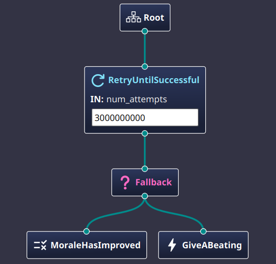

# A Brief Introduction to Behavior Trees

ROS 2 provides a powerful tool for controlling the movement and behavior of robots: the ***Behavior Tree***.
They are simple XML files that you can create which can then be used to execute complex behaviors for the robot.
Look at this simple, hypothetical example of a behavior tree:

```xml
  <BehaviorTree ID="MainTree">
    <RetryUntilSuccessful num_attempts="3000000000">
      <Fallback>
        <MoraleHasImproved/>
        <GiveABeating/>
      </Fallback>
    </RetryUntilSuccessful>
  </BehaviorTree>
```

This behavior tree will keep beating the robot until its morale has improved.

You can also visualize the behavior tree in a graphical way, like this:

<figure style="text-align: center;" markdown="1">
  <a name="fig:beatings_will_continue"></a>
  
  <figcaption>The beatings will continue until morale improves</figcaption>
</figure>

To make the the discussion a bit easier to read, I will often shorten the term ***behavior tree*** to ***BT*** from now on.

## What is a Behavior Tree?

First, some vocabulary.
A BT is composed of `nodes`. Graphically, think of nodes as the boxes in the [picture](#fig:beatings_will_continue) above.
Nodes are connected to each other in a `parent` to `child` relationship, represented by the lines connecting the boxes in the picture.
Every node but one has exactly one parent and may have none, one, or multiple children.
Only one node in the tree has no parent, and that node is called the `root` node.
Nodes which have no children are called `leaf` nodes.

There are four general categories of nodes that can be used in a behavior tree:

* `Action` nodes usually cause things to happen. Action nodes are leaf nodes.
   Examples of action nodes might be: `MoveForward`, `FollowPath`, or `GoToDock`.
* `Condition` nodes define a test that must be met. Condition nodes are leaf nodes.
  Examples of condition nodes might be: `IsBatteryLow`, `IsDistanceTravelledGreaterThan`, or `IsRobotAtDock`.
* `Control` nodes govern the flow of execution.
  Examples of control nodes might be:
  * `Fallback` The child nodes are a sequence of behaviors that are tried in order until one succeeds.
  * `RecoveryNode` Will try to recover from failure of the first child node by executing the second child node.
  * `Sequence` Performs the behavior of the child nodes in order.
* `Decorator` nodes modify the behavior of the child node.
  Examples of decorator nodes might be:
  * `RateController` Limits the frequency at which the child node is executed.
  * `SingleTrigger` Ensures that the child node is only executed once.
  * `Inverter` Inverts the ***Success*** / ***Failure*** status of the child node.

Every node in the tree is backed by a piece of code.
There are a set of general nodes provided by the BT library, and additional, navigation specific nodes
provided by the `nav2` package, but you can also create your own nodes. 
To create your own nodes, you will need to write your own code to implement the behavior of the node,
following rules for class inheritance and use some macros to register the node with the BT library.

## How Does a Behavior Tree Work?

A node represents some kind of behavior. A node performs its behavior when it receives a signal called `tick`.
Every time a node gets ticked, it should respond quickly with one of three states: `SUCCESS`, `FAILURE`, or `RUNNING`.
Well, some nodes are not allowed to return all of those states, but we will get to that later.

When a BT is started, the root node is ticked, and that tick is passed down through the tree to the child nodes according to the rules 
for how each kind of node works,.
All the nodes that get ticked are supposed to return a state quickly to that the BT can get ticked again, over and over, until
the BT has reached some sort of conclusion.
It's not unusual for the root node to be ticked a hundred times a second or faster.
This fast ticking is necessary to keep the robot responsive to changes in the environment.

As an example, the `MoveForward` Action node, which is likely to take a bit of time to actually move the robot,
would return ***RUNNING*** when it was first ticked.
Nodes that can't complete their behavior quickly should return ***RUNNING*** when they are ticked the first time.
They might continue returning ***RUNNING*** on subsequent ticks until they are finally able to complete the
designed behavior, in which case they will return ***SUCCESS*** to indicate that the node completed its behavior.
If the node finds it cannot complete its designed behavior, it should return ***FAILURE***.

Again, `MoveForward` would probalby return ***RUNNING*** the first time it was ticked and perhaps for some number of ticks
after that, until the robot moves the desired distance, at which point it would return ***SUCCESS***.
If, however, `MoveForward` found that it was unable to move the robot forward, because the robot ran out of battery power, or the
wheels kept slipping and not moving the robot, you get the idea, it would return ***FAILURE*** the next time it was ticked after it detected the problem.
