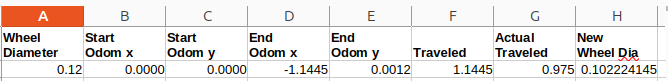
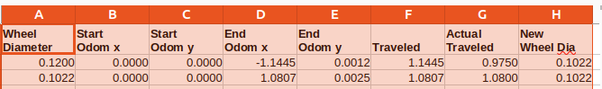
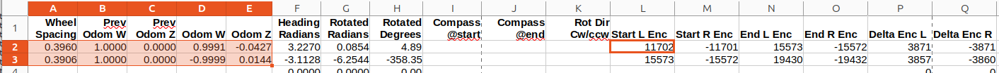

# Calibrating your odometry

## Why calibrate your odometry?

The odometry of a robot is the measure of the robot's position and orientation (pose) in space.
Odometry values usually come from the motor driver for your robot.
They are usually calculated by integrating the robot's velocity over time.
This happens by sampling the rotation of the wheels as sensed by the wheel encoders.
Knowing the amount of time between samples, the rotation of each wheel in radians during that time, and the wheel diameter,
you can calculate the distance traveled and the velocity of each wheel during
that sample interval.
By also knowing the distance between the wheels, you can calculate the arc or line the robot traveled during the sample interval.
By integrating these arcs or lines, you can calculate the robot's pose over time relative to where the robot was when it started up.

Note that correct integration relies on sampling happening over short distances.
If the robot moves too far between samples along curved lines, the integration can be wildly off.
This means that the odometry calculation should occur often, on the order of 20 to hundreds of times per second
for a robot moving at a walking pace.
More samples per second is better as a rule of thumb.

But wheel odometry is not perfect.
There are errors in the measurements of the wheel encoders, such as noisy signals which may
undercount or overcount the 'ticks' from the wheel encoders.
The sampling interval is not precisely known.
There are errors in the digital math used for the computation of the integration of the velocity.
These errors can accumulate over time and cause the odometry to drift away from its actual pose.
So, odometry is an estimate of the robot's actual movement.

If the errors are too large or the odometry reports don't come in fast enough,
the ability to create a map of the robot's environment or to navigate through it can be compromised.

Odometry, as described, relies especially on two fundamental physical measurements of the robot:
the wheel diameter and the distance between the wheels.
The wheel diameter is the easier to estimate with fair precision using, say, a caliper, but that often won't be enough.
The effective wheel diameter may change as the tire wears, or as the wheel tilts,
or will depend on the kind of surface the robot is moving on.
Even knowing the wheel diameter, the odometry may still be off if the wheel diameter is not the same for both wheels.
Robot wheels often slip on the ground as they turn, and usually in an unpredictable way.
Odometry doesn't report how the robot actually moved, it reports how the robot was seemed to move, given
the wheel encoder's readings.

The distance between the wheels is harder to estimate, and it is usually the source of the largest errors in odometry.
The distance between the wheels can be estimated by measuring the distance between the wheel centers,
but this is not always accurate and is affected by several factors.
Tires are usually not flat, and the point of contact with the ground may change for a number of reasons,
so it is hard to know what the contact distance between wheels is.
The distance may be different when the robot is moving in a straight line versus when making
a left turn versus when making a right turn.
The wheels may be tilted, and each wheel can be tilted differently.
The wheels might wobble, making the distance between them change as the wheels turn.

This is one of the reasons that I often say that everything about robots is hard.
My example when I give talks about robots is that just because the robot's computer tells the motor controller to turn the wheels
doesn't mean that the controller got that command.
If the motor controller got a command to move the wheels and sent a signal for the motors to turn,
it doesn't mean that the motors actually turned or turned as commanded.
If the motors turned, it doesn't mean that the wheels turned or turned as much as the motor shaft turned.
If the wheels turned, it doesn't mean that the robot body moved or moved as much as the wheels turned.
If the robot body moved, I can usually say that the robot did not go exactly where it was commanded to go.

It can probably be said that sensors lie all the time, and it's the job of the software to figure
out how much they are lying and correct for it.
Fortunately, figuring out how much the odometry is lying is somewhat tractable as localization
is usually a part of a closed-loop system.
The software never just assumes that the robot moved as commanded; it also checks sensors like LIDARs,
cameras, time-of-flight sensors, SONAR, IMUs, GPS, and so on to try to correct the reported odometry to
agree with other sensors. The software tries to find the best truth from all of the lies.

Still, the more accurate the odometry, the better the robot can navigate and map. Conversely,
if the odometry is very far off, the robot may not be able to navigate or map at all.

Calibrating the odometry, for the purposes of this chapter, is the process of trying to improve the measurement
of the wheel diameter and the distance between the wheels.
The process is usually done by driving the robot in a controlled way and comparing the reported odometry
to the actual pose of the robot.

The following methodology assumes you are calibrating a two-wheel, differential drive robot.
You should be able to generalize this process for a different kind of robot, though it will involve a bit of mathematics.
You might, for instance, look at [Kinematics for Wheeled Mobile Robots](https://nu-msr.github.io/navigation_site/lectures/derive_kinematics.html)

## How to calibrate your odometry

I usually separate the calibration of the two measurements.
The process is fundamentally the same for correcting the wheel diameter and the distance between the wheels.
For correcting the wheel diameter, you will need a tape measure.
For correcting the distance between the wheels, you will need a compass and/or mark the position of the wheels
of the robot where they contact the ground.

The steps involved in both calibrations are, basically:

* Place the robot in a known pose.
* Read the odometry at the beginning of the iteration.
* Move the robot in a known way that should be affected primarily by just the
wheel radii or just the distance between the wheels. 
The odometry from driving forward or backward is mostly affected by the wheel diameter.
The odometry from spinng the robot in place is mostly affected by the distance between the wheels.
* Read the odometry at the end of the iteration.
* Compare the actual pose of the robot to the reported pose.
* Adjust the software values for the wheel diameter or the distance between the wheels.
* Repeat until the reported odometry pose is as close as possible to the actual pose.

The assumption here is that you have the ability to alter the input to the process that is
producing the odometry.
If some manufacturer's software driver is producing the odometry, you should be able to alter the
parameters of the driver to get the odometry to be more accurate.
Often this comes in the form of a configuration file that you can edit, or is supplied as a parameter
in a launch file.
If you are writing your own odometry code, as in writing your own motor driver software or writing, say,
a class that implements the ros2_control API, you should be able to alter the code to use the calibrated
wheel diameter and distance between wheels.

Also note that these two measurements are likely to not be exactly the same as that used to create the URDF
for the robot.
They can be, but need not be.
The URDF is mostly used for visualization and collision detection, not necessarily for calculating odometry.

Now, pay attention to this. Remember all of those things mentioned above that can affect
the odometry: the sampling interval isn't precise, wheels slip, and so on. Especially if you are computing
odometry using a Linux process, you will be hit with process preemption and similar Linux issues which are going to
make it hard to get good odometry. If at all possible, never compute odometry using a computer that is
going to result in the odometry code not being called often or not being called at a regular interval.

## Calibrating the wheel diameter

Repeat the following steps until odometry measured from driving the robot in a straight line,
forward and backward, is pretty close between
the observed physical position of the robot and the reported odometry.
You need to do this measurement repeatedly.
Don't assume that when it works once that you're done.

1. Place the robot in a known pose.
Before you move the robot, mark its current position.
The easy way to do this is to take a short length of blue, painter's tape and put it on the floor
at the very bottom of one of the wheels, where it touches the ground.
It doesn't have to be under the wheel, it could be beside the wheel.
The thing I use, instead of tape, is a small jeweler's square. I place it so that the short edge is on
the floor in the front or back of the robot and the long edge touches the front most or back most part of the
robot body.
After the robot moves, you will put another piece of tape at the bottom of the same wheel and measure
the distance, in meters, between the same edges of the two pieces of tape.
Or, in my case, I just measure the distance from the jewler's square to the front or back of the robot body.

1. Read the current odometry value via the following command. Replace the ***/odom*** topic with the
topic that your odometry is published on.

   ```code
   ros2 topic echo /wheel_odom --once | head -17
   ```

   The output should start with something like:

   ```code
   header:
     stamp:
       sec: 16
       nanosec: 320000000
     frame_id: odom
   child_frame_id: base_link
   pose:
     pose:
       position:
         x: -3.40717210659393e-16
         y: -8.0459616687065e-36
         z: 0.0
       orientation:
         x: 0.0
         y: 0.0
         z: 5.0907089586332814e-20
         w: 1.0
   ```

   The information you want to capture are the ***x*** and ***y*** values under ***position***.
   This is the current position of the robot along the axis where you're about to drive the robot.
   You will next drive the robot forward a bit and, ideally, only the ***x*** and ***y*** values will change much.

1. Move the robot forward a known distance. The way I do this is to run the ***teleop_keyboard_twist***
package, like so:

   ```code
   ros2 run teleop_twist_keyboard teleop_twist_keyboard
   ```

   You will see a prompt in the terminal window. Press the ***i*** key to move the robot forward and then
   after the robot has moved forward a bit, ideally at least a meter if you have room, press the ***k*** key to stop the robot.

1. As above, read the current odometry  value again and capture the ***x*** and ***y*** values under ***position***.
   Use the pythagorean theorem to calculate the distance the robot moved, which is:

    ```math
    distance = \sqrt{(x_{\text{at end position}} - x_{\text{at start position}})^2 + (y_{\text{at end position}} - y_{\text{at start position}})^2}
    ```

2. Measure the actual distance the robot moved using a tape measure.
If the robot moved forward more than a meter, and the odometry distance and the actual distance are nearly
identical, say within one or two millimeters, you are lucky, indeed.
The goal is to get the odometry distances and the actual distances to be as close as possible, repeatedly.
If this is so after, say, a dozen movements, forward and backward, you are done.

1. If the odometry distance and the actual distance are not close, you will need to adjust the wheel diameter
  as known to your motor driver software.
  If the actual distance is greater than the odometry distance, you will need to increase the configured wheel diameter.
  Likewise, if the actual distance is less than the odometry distance, you will need to decrease the wheel diameter.

    You could calculate the new wheel diameter by 
    * Divide the actual distance traveled by the odometry distance traveled, call this ***correction_ratio***.
    * Multiply the current wheel diameter by the ***correction_ratio*** to get the new wheel diameter.

    For example, if the robot moved 0.975 meters and the odometry said the robot move 1.1445 meters,
    the ***correction_ratio*** is 0.975 / 1.1445 or 0.851.
    If the current wheel diameter is 0.12 meters, the ***correction_distance*** is 0.12 * 0.851 = 0.10212.

    I have provided a LibreOffice Calc spreadsheet that will help you calculate the corrected wheel diameter,
    it can be found in the workspace at
    [src/Robotics_Book/book/media/CalibratingWheelDiameter.ods](../media/CalibratingWheelDiameter.ods).

    The following shows a screenshot of me using the spreadsheet for just that scenario.
    
    
    My starting wheel diameter was 0.12 meters.
    My original odometry ***x*** and ***y*** values were zero.
    I moved the robot about a meter backwards.
    I then used the following command to show the ending odometry values


    ```code
    ros2 topic echo /wheel_odom --once | head -17
    ```

    Which, in my case, showed the following:

    ```code
    header:
      stamp:
        sec: 1735710437
        nanosec: 219000000
      frame_id: odom
    child_frame_id: base_link
    pose:
      pose:
        position:
          x: -1.1445443630218506
          y: 0.001237474731169641
          z: 0.0
        orientation:
          x: 0.0
          y: 0.0
          z: 1.7074978930775586e-10
          w: 1.0
     ```

    I pulled the ***x*** and ***y*** values from the ***position*** section and put it into the 
    ***End Odom x*** and ***End Odom y*** cells of the spreadsheet. 
    The spreadsheet showed that the odometry reported that the robot moved 1.1445 meters (backwards in this case),
    but the actual distance I measured with a tape measure was 0.975 meters.
    The spreadsheet calculated that the new wheel diameter should be 0.102124145 meters.

    I put in the new wheel diameter into my robot and repeated the experiment moving the robot forward
    about a meter. I captured the start and end odometry values with the same command as above and put them
    into the spreadsheet on row 3. The result was:

    

    As you see, the actual and odomotry distances are now pretty much bang on.

1. Repeat the process until the odometry distance and the actual distance are as close as possible.

## Calibrating the distance between the wheels

This process is similar to that of calibrating the wheel diameter.
Repeat the following steps until the odometry measured from rotating the robot in place is pretty close between
the observed physical heading of the robot and the heading from the odometry topic.
You need to do this measurement repeatedly.
Don't assume that when it works once that you're done.
Try it several times, maybe a dozen times.
You may even find that odometry is accurate when, say, turning left but is off when turning right.

To make this process easier, I've provided a LibreOffice Calc spreadsheet that will help you calculate the
error in rotation of the robot.
It can be found in the workspace at [src/Robotics_Book/book/media/CalibratingRotation.ods](../media/CalibratingRotation.ods).

Each time you are going to do a rotation, put the current distance between the wheels into the spreadsheet
in the ***Wheel Spacing*** column. This is just for documentation purposes.
To correct the distance between the wheels, you are going to observe the difference between the actual
rotation of the robot and the rotation reported by the odometry, make a change to the
configuration value of the distance between the wheels, do a 360-degree rotation again,
and then observe the difference again.

Here are the steps:

1. Place the robot in a known pose.
Before you move the robot, mark its current position.
The easy way to do this is to use your phone with a built-in compass app and place the phone on the surface
of your robot and don't move it until you are done calibrating. 
Since a phone's compass doesn't have a lot of precision or repeatability, a better way is to mark the robot's
current position with a piece of tape by putting it on the ground beside one of the wheels
at the bottom of the wheel where it touches the ground. What I do is use a small jeweler's square and place it
so that the short edge is on the floor in and place the long edge next to a mark I've made on the robot body.
Make sure the rotation of the robot won't knock the jeweler's square from it's position.
You are going to rotate the robot in place and you want to try to rotate the robot 360 degrees
in place, getting the marked wheel back to the original position.

1. Read the current odometry value via the following command.
  Replace the ***/odom*** topic with the topic that your odometry is published on.

   ```code
   ros2 topic echo --once --flow-style /odom
   ```

   You will see output something like:

   ```code
   header:
   stamp:
    sec: 16
    nanosec: 320000000
   frame_id: odom
   child_frame_id: base_link
   pose:
   pose:
    position:
      x: -3.40717210659393e-16
      y: -8.0459616687065e-36
      z: 0.0
    orientation:
      x: 0.0
      y: 0.0
      z: 5.0907089586332814e-20
      w: 1.0
   covariance:
   ```

   With more lines after the ***covariance*** line. There will be other differences as well.
   The information you want to capture is the ***w*** and ***z***  values under ***orientation***.
   This is the current heading of the robot.

   Place the ***w*** and ***z*** values into the spreadsheet in the ***Prev Odom W*** and ***Prev Odom Z*** cells.
   As mentioned above, you should always note the current configured distance between the wheels
   in the ***Wheel Spacing*** column.
   You will next rotate the robot in place and, ideally, only the ***w*** and ***z*** values will change noticeably.

   If you are using a compass to track rotation, you can use the ***Compass Heading*** column to note the compass heading before
   you do the rotation.

1. Rotate the robot in place 360 degrees. The way I do this is to use the ***teleop_keyboard_twist** package, like so:

   ```code
   ros2 run teleop_twist_keyboard teleop_twist_keyboard
   ```

   You will see a prompt in the terminal window. Press the ***l*** key to rotate the robot clockwise in place
   or the ***j*** key to rotate anticlockwise. Then after the robot has rotated 360 degrees, press the
   ***k*** key to stop the robot.
   I found that I needed to jog the robot a bit to get to an accurate 360-degree rotation.
   This I did by tapping either the ***j*** or ***l*** key as needed for a short time and then
   pressing the ***k*** key to stop the robot.
   Remember, you are trying to get the robot back to the point where it was when you started the 360-degree rotation.

2. As above, read the current odometry value again and capture the ***w*** and ***z*** values under ***orientation***.
   If your robot is a well-designed, 2-wheel differential drive robot, the ***x*** and ***y*** values under ***orientation***
    should also have not changed much from the values captured in step 2, nor should the ***x*** and ***y*** values under ***position***.

3. Using the LibreOffice Calc spreadsheet that I provided, put the new values of ***w***
   and ***z*** from step 4 into the spreadsheet into the ***Odom W*** and ***Odom Z*** cells.
   The ***Heading Radians*** shows the reported current heading of the robot from the ***odom*** topic.
   The ***Rotated Radians*** shows the reported rotation in radians of the robot from the ***odom*** topic.
   The ***Rotated Degrees*** shows reported rotation in degrees&mdash;this value should be close to 360 or 0.

4. If ***Rotated Degrees*** value is a positive number, you will need
   to decrease the configured distance between the wheels.
   If ***Rotated Degrees*** is a negative number, you will need
   to decrease the configured distance between the wheels.
   You could calculate the new distance between the wheels by multiplying the current distance between
   the wheels by the ratio of the actual rotation to the odometry rotation.
   If that is too much math, you could just try adding or subtracting a small amount to the current distance between the wheels value.
   Here is an example of how to calculate the new distance between the wheels.

   For an example of how to calculate a new wheel distance, look at the following snapshot from when I calibrated my robot.
   
   
   
   The first attempt at a 360 degree rotation with a wheel distance of 0.396 meters
   showed an error of 4.89 degrees, as shown in the ***Rorated Degrees*** column for row 2.
   That is, measuring the angle from the quaternion before rotation of w,x,y,z={1.0, 0.0, 0.0, 0.0} and
   the quaternion after rotation of w,x,y,z={-0.999, 0.0, 0.0, 0.0144} is 0.0854 radians or 4.89 degrees.
   Since the robot rotated 360 degrees, the quaternions should result in the same angle before and
   after rotation.

   Since this was a positive error, I needed to decrease the distance between the wheels for the next attempt.
   The proportional amount to correct is the 4.89 degrees divided by the actual 360 degrees of rotation I made,
   which comes out to be a multiplier of 0.01358333333.
   Multiplying this by the current distance between the wheels, 0.3960 meters, give gives 0.005379 which,
   when subtraced from 0.3960 gives 0.3906 meters as the corrected distance to try for the next run.
   
   I put this new distance of 0.3906 as the wheel distance into my robot and rotated it again 360
   degrees. As you see from row 3, the resulting odometry is off by only 1.65 degrees, which is a smaller error than the previous run.
   For my robot, the error of only 1.65 degrees represents about 18 ticks of the wheel encoders, or about 6 degrees of one wheel rotation.
   My robot made about 4 wheel rotations to get the robot to rotate 360 degrees, or 1440 degrees of wheel rotation.
   Begin off 1.65 degrees after rotating 1440 degrees is about a 0.1% error.
   This, to me, was a good calibration of the distance between the wheels.

   ```code
   ```

5. Repeat the process until the odometry rotation and the actual rotation are as close as possible.
   What you are likely to find is that the ***Rotated Degrees*** gets closer and closer to the ideal 360 or
    0 degrees as you change the distance between the wheels value, and then as you make further changes in
    the same direction (smaller or larger between iterations), the ***Rotated Degrees*** will start to
    get further away from the ideal 360 or 0 degrees. Go back to the settings that gave you the smallest error.
