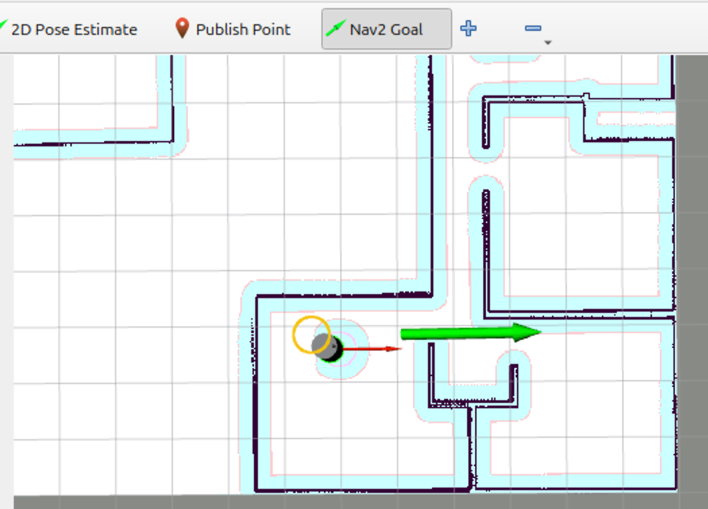
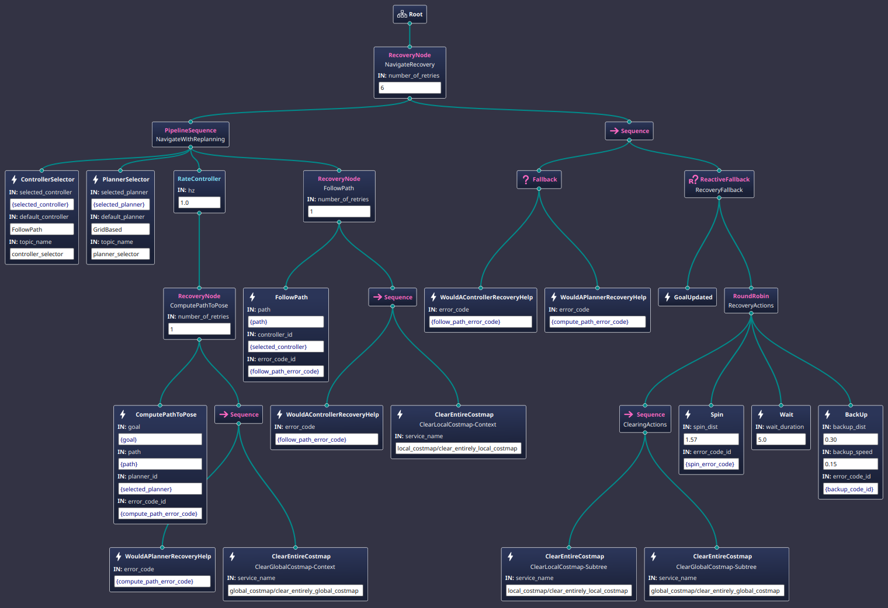

# What Happens When You Navigate Using rviz2

## Using rviz2 to Move Your Robot to a Pose

When you fire up ***rviz2*** after having launched your robot and the ***nav2 stack***,
you can cause your robot to move towards a pose that you establish
by clicking and dragging your mouse in the rviz2 window that shows the map.
To do so, you select the ***Nav2 Goal*** tab in the ***rviz2*** menu, then click on the location you want your robot to
move to and, while the mouse is still down, drag your mouse to establish the
direction you want your robot to point when it gets to that position.
You see the result as something like the thick, green arrow shown in
this partial screenshot of the ***rviz2*** window.



From there, the various components of the ***nav2 stack*** will take over and
send movement commands to your robot to put it at the position and orientation
you chose.

So, what happens under the hood?

When you launch the ***nav2 stack***, one of the nodes launched is the
***bt_navigator*** node. This node, among other things:

* Reads the ***navigation.yaml*** file (or whatever other file name you gave it in your 
  launch file) to find the names of navigators to be used, one for navigating to a 
  single pose, as is being described now, and another to be used to navigate to a 
  list of poses, if you wanted to lay out a series of waypoints to be followed 
  along a complex path. Here are the relevant lines from my ***navigation.yaml*** file.

  ```code
  navigators: ["navigate_to_pose", "navigate_through_poses"]
    navigate_to_pose:
      plugin: "nav2_bt_navigator::NavigateToPoseNavigator"
    navigate_through_poses:
      plugin: "nav2_bt_navigator::NavigateThroughPosesNavigator"
    ```

* Those two navigators are then loaded into memory and started as pieces of code.
  Each navigator is an ***action server*** (which is described elsewhere
  in this book).
  Any bit of ***ROS 2*** code, such as ***rviz2***, can request that an action server perform the service it was
  designed for.
  This is, in fact, how ***rviz2*** will communicate between your
  mouse click and the ***nav2 stack***.

* Reads the ***navigation.yaml*** file to get the list of any custom
  ***behavior tree*** node kinds (discussed elsewhere in this book) that you
  or someone else wrote, outside of the default set of ***behavior tree***
  node kindss provided by the ***nav2 stack***. Those custom node kinds are also loaded
  into memory so that they can extend the set of things you can do with
  a ***behavior tree*** beyond the default set provided.
  This next code snippet is used in one of my experiments for my robot to
  load in two custom ***behavior tree*** bits of code that I wrote.
  Most people when they begin building a robot using ***ROS 2*** will
  not have lines like this in their ***navigation.yaml*** file.l

  ```code
      plugin_lib_names:
      - sigyn_say_something_plugin_node
      - sigyn_move_a_short_distance_ahead_plugin_node
    ```

When ***rviz2*** starts up, it forms a connection to the two navigators
just described. 
That is, it forms an ***action server client*** connection
(again, to be described later) to the two default navigators provided by
the ***nav2 stack***. 
Each of those navigators needs a ***behavior tree*** XML file to describe
the actions needed to actually move the robot and how to deal with
problems that come up while moving, and they also need the actual ***goal***
or list of goals that you gave, such as when you did the click and drag in
***rviz2*** to specify where the robot should move.

When you click and drag as above, the goal pose (position and orientation) is
captured and sent via the ***action server client*** connection to the
appropriate navigator.

For our example, the default navigator is a module written in the C++ computer language 
with a class name of ***NavigateToPoseActionServer***.
Knowing the name of that class is how the ***navigation.yaml*** file tells the ***bt_navigator***
***ROS 2*** node to find the needed code to run.
As with most things we are talking about here, this code is provided by default
with the ***nav2 stack*** code that comes with the ***ROS 2*** software package.

When it started up, ***NavigateToPoseActionServer*** also read the ***navigation.yaml*** file to find out
what behavior tree it should use to move the robot.
The following code snippet shows how you would put lines in the ***navigation.yaml***
file to specify the ***behavior tree*** to be used.
Until you understand ***behavior trees*** well enough to create your own
custom one, you won't have any lines like this in your ***navigation.yaml*** file.

```code
    default_nav_to_pose_bt_xml: '/opt/ros/jazzy/share/nav2_bt_navigator/behavior_trees/navigate_to_pose_w_replanning_and_recovery.xml'
```

When the ***NavigateToPoseActionServer*** gets called via the
***action server client*** and gets the associated ***goal*** (or list of goals)
you gave, it sets up the starting environment and begins interpreting those instructions for the given ***behavior tree***
to be followed .

The finer internal details of how this all works can be skipped for now so
we can concentrate on a general overview of what ***behavior trees*** are and
how they cause the robot to move.

## Introduction to Behavior Trees as Used in ROS 2
For this discussion, a ***tree*** is a collection of ***nodes***
(think visually of boxes) and lines that connect boxes together.
The connections always go from a single box, called the ***parent node***,
to one or more boxes called ***child nodes***.
All the nodes are connected together this way such that there is only a single
node, called the ***root node***, which has no parent.
Hence, the whole thing looks like a tree which starts out as a single node which
branches out to one or more other nodes, and each of those nodes can branch
out to other nodes.
This also implies that there aren't any loops in the connection between the
node boxes, since any node can only have one and only one parent.
And, again, importantly, there is exactly one node in any tree that has no parent, and
that is the ***root node***.

Now, let's have a brief overview of the language we use when talking about ***behavior trees***.

As we discussed above, a ***behavior tree*** has a set of ***nodes*** that are connected together.
A ***node*** is interpreted, or executed if you like, by ***ticking*** the ***node***.
A ***node*** responds by trying to do whatever behavior it was designed to do and responding
with one of three statuses describing how that try went: ***Success***, ***Failure***, or ***Running***.

* ***Success*** is kind of obvious—it indicates that the ***node*** managed to do what was said on
the box and the node is done doing all its work.

* A ***Failure*** response is also obvious—the node was unable to completely accomplish what it
was supposed to do and has given up doing any more work.
There may have been side effects along the way, such as the robot
smashing into something and damaging it.
Unless a ***node*** has indicated otherwise in its documentation, you shouldn't expect that the ***node*** is going
to try to cleanup after itself.
You can use the ***behavior tree*** itself, however, to do
any cleanup as you'll come to see as you better understand
how ***behavior trees*** work.

* ***Running*** is less obvious. ***Nodes*** must complete their work quickly for a 
  ***behavior tree*** to work properly. If they cannot,
if it will take a bit of time, or even a lot of time to complete its designed work, then the
***node*** should start doing its work in the background and return ***Running*** every time
the ***node*** is ticked until it finally finishes trying to do its work. When finished, the
next time the ***node*** is ticked, it will finally respond with ***Success*** or ***Failure***.

***Nodes*** also have an `name` attribute that should be used to give the human reader an idea about what the node is trying to accomplish.

## An Introduction to Behavior Trees by a Real Example


With that background in mind, here is the actual default behavior tree provided by the ***nav2 stack*** for navigating to a pose.
It's written in XML.
My assumption is that you can read an XML file and understand the terms ***element*** and ***attribute***.
Let's go over the tree one element at a time.

```code
<!--
  This Behavior Tree replans the global path periodically at 1 Hz and it also has
  recovery actions specific to planning / control as well as general system issues.
  This will be continuous if a kinematically valid planner is selected.
-->
<root BTCPP_format="4" main_tree_to_execute="MainTree">
  <[BehaviorTree](https://www.behaviortree.dev) ID="MainTree">
    <RecoveryNode number_of_retries="6" name="NavigateRecovery">
      <PipelineSequence name="NavigateWithReplanning">
        <ControllerSelector selected_controller="{selected_controller}" default_controller="FollowPath" topic_name="controller_selector"/>
        <PlannerSelector selected_planner="{selected_planner}" default_planner="GridBased" topic_name="planner_selector"/>
        <RateController hz="1.0">
          <RecoveryNode number_of_retries="1" name="ComputePathToPose">
            <ComputePathToPose goal="{goal}" path="{path}" planner_id="{selected_planner}" error_code_id="{compute_path_error_code}"/>
            <Sequence>
              <WouldAPlannerRecoveryHelp error_code="{compute_path_error_code}"/>
              <ClearEntireCostmap name="ClearGlobalCostmap-Context" service_name="global_costmap/clear_entirely_global_costmap"/>
            </Sequence>
          </RecoveryNode>
        </RateController>
        <RecoveryNode number_of_retries="1" name="FollowPath">
          <FollowPath path="{path}" controller_id="{selected_controller}" error_code_id="{follow_path_error_code}"/>
          <Sequence>
            <WouldAControllerRecoveryHelp error_code="{follow_path_error_code}"/>
            <ClearEntireCostmap name="ClearLocalCostmap-Context" service_name="local_costmap/clear_entirely_local_costmap"/>
          </Sequence>
        </RecoveryNode>
      </PipelineSequence>
      <Sequence>
        <Fallback>
          <WouldAControllerRecoveryHelp error_code="{follow_path_error_code}"/>
          <WouldAPlannerRecoveryHelp error_code="{compute_path_error_code}"/>
        </Fallback>
        <ReactiveFallback name="RecoveryFallback">
          <GoalUpdated/>
          <RoundRobin name="RecoveryActions">
            <Sequence name="ClearingActions">
              <ClearEntireCostmap name="ClearLocalCostmap-Subtree" service_name="local_costmap/clear_entirely_local_costmap"/>
              <ClearEntireCostmap name="ClearGlobalCostmap-Subtree" service_name="global_costmap/clear_entirely_global_costmap"/>
            </Sequence>
            <Spin spin_dist="1.57" error_code_id="{spin_error_code}"/>
            <Wait wait_duration="5.0"/>
            <BackUp backup_dist="0.30" backup_speed="0.15" error_code_id="{backup_code_id}"/>
          </RoundRobin>
        </ReactiveFallback>
      </Sequence>
    </RecoveryNode>
  </BehaviorTree>
</root>
```

Below is the same tree shown graphically using the  program.



The ***root node*** must be a `root` element. Currently, it should have a `BTCPP_format` attribute value of 4.
It should name the `BehaviorTree` element to be used as the starting ***behavior tree***.
This allows multiple ***behavior trees*** to be located in the same XML file, and the interpreter
of the file knows which one to use at the start.

There must be at least one `BehaviorTree` element in the XML file, and exactly one should also have an `ID` attribute
matching that named in the `root` element. The `BehaviorTree` element must be a child of the `root` element.

So far, what we've seen is just structural. Now let's get into some meat of the ***behavior tree***. 
A ***BehaviorTree*** element must have exactly one child element. In this case, it's a `RecoverNode` element.

Semantically, a `RecoveryNode` element must have exactly two children. 
The first child represents what should be accomplished and the second child represents some action to take if
the first child fails—it's some recovery behavior that tries to clear whatever made the first child fail.

The behavior of the `RecoveryNode` then is to try to execute the first child—or you might think of it as
trying to perform the behavior represented by the first child.
If the first child succeeds, the `RecoveryNode` is done and it also succeeds.
If the first child fails, though, the second child is executed.
If the second child succeeds, then the expectation is that it likely cleared whatever caused the
first child to fail, so the `RecoveryNode` should go ahead and
 retry the first child.

A `RecoveryNode` has a `number_of_retries` attribute that specifies how many times it should attempt the
try-to-do-using-first-child/recover-using-second-child pair before it finally gives up.

The first child of the ***NavigateRecovery*** `RecoveryNode` is a `PipelineSequence` node called ***NavigateWithReplanning*** and the second child is a `SequenceNode`.
Without further examination, we can guess that the ***NavigateRecover*** node is going to try to navigate (i.e. move the robot), doing some replanning along the way as the robot moves,
and if some problem comes up, there will be some sequence of behaviors that will be tried in order to clean up whatever was preventing the robot from moving towards the goal.

A `PipelineSequence` node is a tricky node if you're not used to the concept of how some computer systems implement a ***pipeline*** operation.
A ***pipeline*** is a list of things that are connected together such that the first thing feeds something to the second thing that may or may not operate on that input, then the second thing then feeds something to the third thing which may or may not operate on its input, and so on.
Whatever the first thing in the pipeline produces kind of gets pushed through all the things down the line.

More formally, the ***nav2 stack*** `PipelineSequence` node here begins by ***ticking*** its first child until that child returns a ***Success*** status.
Then the `PipelineSequence` ***ticks*** the first and second child until the second child returns ***Success***, then the first three children are ***ticked*** and so on until either all children report ***Success*** or until one of them reports a ***Failure*** status.

To interpret what is happening for the ***NavigateWithReplanning*** `PipelineSequence` node, it will select a controller (a piece of code that will be able to compute a path to move the robot towards a goal), then select a planner (a piece of code that is able to find a best route to move the robot from one point on a map to another point on a map), and then some kind of behavior is going to be repeated once every second, and, finally, there will be some behavior that will attempt to follow a path, using some recovery behavior if necessary.

As an aside here, because this is a `PipelineSequence` kind of node, this means that each time the ***NavigateWithReplanning*** node gets ***ticked*** (and it typically gets ***ticked*** about a hundred times a second), it gets to change its mind about whatever controller is used, and whatever planner is used and so on.

Going back to the top ***NavigateRecovery*** node, if the
***NavigateWithReplanning*** node fails, a recovery action will be tried. The recovery behavior is a `Sequence` node.

A `Sequence` node simply will try the child nodes in order. The first child is ***ticked*** until it returns ***Success***, then it goes on to the second child which is ticked until it returns ***Success*** and so on. If any child of the `Sequence` node returns ***Failure***, the `Sequence` node gives up and returns ***Failure*** itself.
A `Sequence` node does a list of things in order until they all succeed.

We can interpret the tree here to mean that some `Fallback` node will be attempted followed by a `ReactiveFallback` node.

A `Fallback` node is similar to a `Sequence` node in that it can have any number of children.
It is different in that the `Fallback` node will ***tick*** the first child and if that child fails, then the second child is ***ticked*** and if that fails the next child it ***ticked*** and so on.
If any child returns ***Success***, the `Fallback` node stops ***ticking*** the children and itself returns ***Success***.
A `Fallback` node tries a list of things in order until one of them works.

We can interpret the behavior of the `Fallback` node as looking to see if a controller recovery would help. If not, would a planner recovery help? If one of those is true, then the parent `Sequence` node goes on to the `ReactiveFallback` node as part of the recovery of the ***NavigateRecovery*** node we started with.

The `ReactiveFallback` node ***RecoveryFallback*** is similar in function to a `Fallback` kind of node except that the first child node (`GoalUpdated` in this case) constantly gets a chance to interrupt the second child if it suddenly succeeds.
So, if the `GoalUpdated` node is true at any time, then the ***RecoveryFallback*** node will succeed, passing its ***Success*** back up to the parent `Sequence` node which itself will pass the ***Success*** back up to the top level ***NavigateRecovery*** node.

This makes sense if you think about it. While the behavior tree was trying to recover from some condition that made it not be able to immediately plan a path and move the robot to the goal, it suddenly turns out that the user changed its mind about what goal to move towards, so the best thing to do is immediately abandon the effort to move to the old goal and start all over working on the new goal.

Going back to the `RateController` node in the tree, we can interpret what this node is trying to achieve. Once a second, it wants to try to `ComputePathToPose`. 
If, for some reason, the code cannot find a path to the goal pose, like maybe the door out of the room got closed or someone is blocking the robot by standing in front of it, then the ***ComputePathToPose*** `RecoveryNode` will attempt to fix the problem by checking to see if `WouldAPlannerRecoveryHelp` is true and, if so, do `ClearEntireCostMap`.

As long as once per second a path from the current robot position to the goal pose is possible, then the "WithReplanning" part of the ***NavigateWithReplanning*** `PipelineSequence` is still working so the tree moves on to the ***FollowPath*** `RecoveryNode` which is the thing that is finally, actually going to cause the robot to move.

The `FollowPath` node is the bit that sends ***cmd_vel*** topic messages to cause the robot to move. 
If, for some reason, the code that does this fails, then a recovery sequence will be tried which tests to see `WouldAControllerRecoveryHelp` and, if so, `ClearEntireCostMap` is used to clear out any transit cruft that may have accumulated in the cost map, such as the temporary obstacle caused by a person walking in front of the robot.