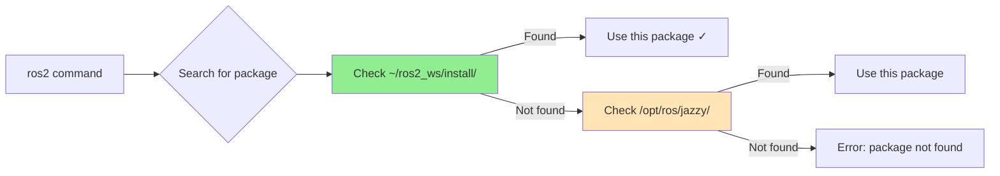
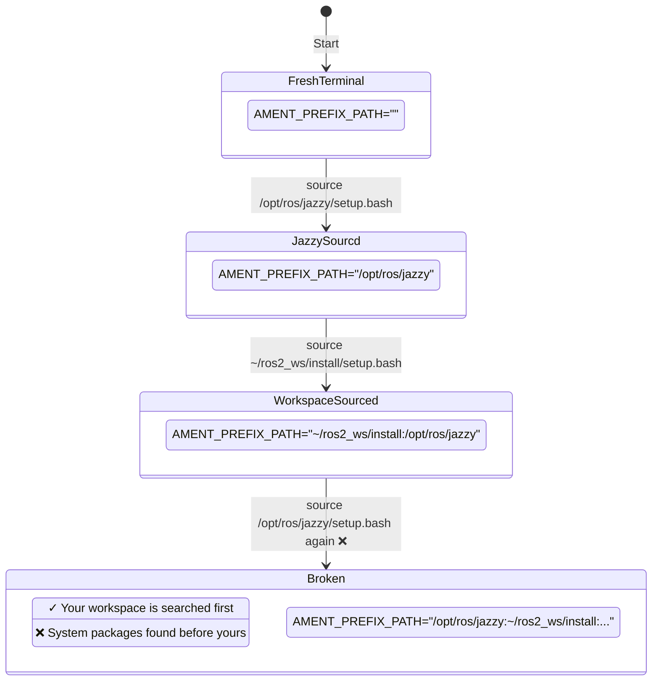
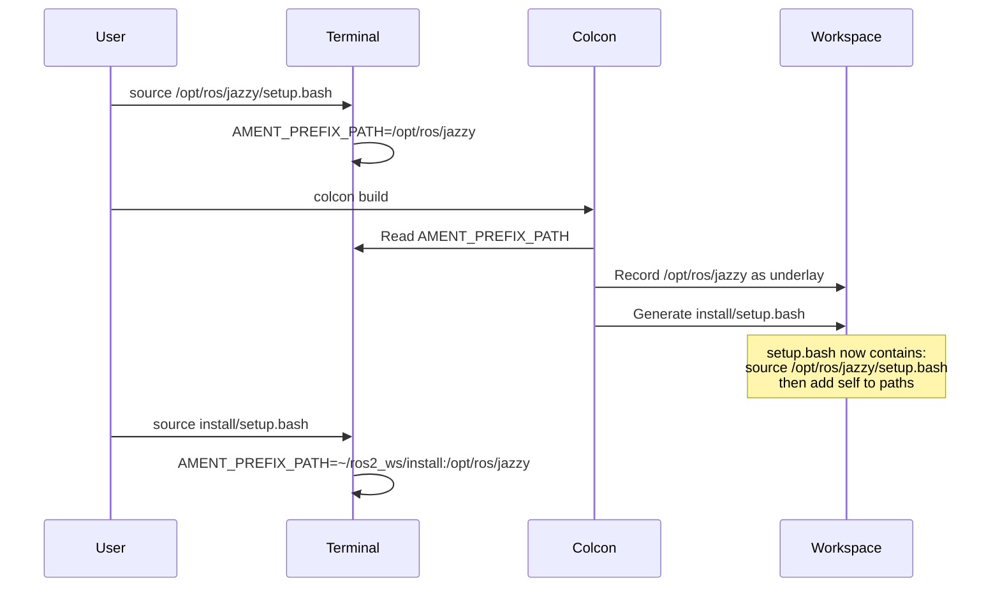

# Understanding the Workspace Chain: How ROS 2 Finds Your Packages

If you've ever been confused about when to `source` things in ROS 2, why your changes aren't taking effect, or why ROS keeps finding the wrong version of your package, you're not alone. The terms "overlay" and "underlay" get thrown around in documentation as if everyone already knows what they mean, but they're actually pointing to a deeper concept that, once understood, will save you hours of frustration.

In this chapter, we'll demystify how ROS 2 actually finds your packages, what really happens when you `source` a workspace, and why the order matters so much. By the end, you'll understand not just the mechanics, but the mental model you need to confidently manage your ROS 2 development environment.

## The Big Picture: It's a Chain, Not Magic

**ROS 2 finds your packages by searching through a chain of directories, in order, and using the first match it finds.** That's it. No magic, no complex algorithm. It's like how your shell finds commands using the `PATH` environment variable—first match wins.

When you `source` a workspace, you're **adding that workspace to the front of the search chain**. The workspace you source last is searched first. This simple fact explains almost every confusing behavior you'll encounter.

Let's build up the mental model step by step, starting with the most common case.

## The Common Case: One Workspace Over ROS 2

When you first installed ROS 2, your `.bashrc` file (or `.zshrc` if you use zsh) probably got a line added that looks like this:

```bash
source /opt/ros/jazzy/setup.bash
```

**What this does**: It sets up environment variables that tell ROS 2 tools where to find packages. The most important one is `AMENT_PREFIX_PATH`, which is a colon-separated list of directories to search (similar to `PATH` for shell commands).

After sourcing, your environment looks like this:

```bash
$ echo $AMENT_PREFIX_PATH
/opt/ros/jazzy
```

At this point, when you run a command like `ros2 launch nav2_bringup navigation_launch.py`, here's what happens:

1. The `ros2` command runs (found via your `PATH`)
2. It sees you want the `launch` subcommand and loads that tool
3. The `launch` tool sees you want a package called `nav2_bringup`
4. It searches through `AMENT_PREFIX_PATH` for a package named `nav2_bringup`
5. It finds it in `/opt/ros/jazzy/share/nav2_bringup/`
6. It loads the launch file from there

Simple enough. But now you want to create your own packages in your own workspace.

### Creating Your First Workspace

You create a workspace (let's call it `~/ros2_ws`) and build a package:

```bash
mkdir -p ~/ros2_ws/src
cd ~/ros2_ws/src
ros2 pkg create my_robot_bringup --build-type ament_python
# ... add your code ...
cd ~/ros2_ws
colcon build --symlink-install
```

After the build succeeds, you have a new directory: `~/ros2_ws/install/`. This directory contains your built packages in a structure that ROS 2 can find.

**Here's the critical part**: Your workspace doesn't automatically know about `/opt/ros/jazzy`. When you built with `colcon`, the build system recorded what workspaces were sourced at build time. This is called the workspace's **underlay**.

Let's look at what happens when you source your workspace:

```bash
source ~/ros2_ws/install/setup.bash
echo $AMENT_PREFIX_PATH
/home/youruser/ros2_ws/install:/opt/ros/jazzy
```

Notice two things:

1. **Your workspace appears first** in the path
2. **`/opt/ros/jazzy` is still there** because your workspace's `setup.bash` automatically sources its recorded underlay

This is by design! When you built your workspace while `/opt/ros/jazzy` was sourced, the build system said "Aha, this workspace depends on `/opt/ros/jazzy`, so whenever someone sources this workspace, I'll automatically source that one too."

Now when you run `ros2 launch my_robot_bringup my_launch.py`, ROS searches:
1. First in `~/ros2_ws/install/` → finds `my_robot_bringup` ✓
2. Would search `/opt/ros/jazzy/` if not found in step 1

<details>
<summary><strong>Deep Dive: What's Actually in setup.bash?</strong></summary>

If you look inside `~/ros2_ws/install/setup.bash`, you'll see it's a generated script that:

1. **Sources its underlay first**: It calls `source /opt/ros/jazzy/setup.bash` (or whatever was sourced when you built)
2. **Then adds itself to the search paths**: It prepends your workspace to `AMENT_PREFIX_PATH`, `CMAKE_PREFIX_PATH`, `PATH`, `PYTHONPATH`, `LD_LIBRARY_PATH`, and other environment variables
3. **Exports functions**: It sets up helper functions for ROS 2 tools to use

The key insight: **The underlay relationship is recorded at build time, not source time.** You can't change what a workspace considers its underlay by sourcing in different orders—that relationship was frozen when you ran `colcon build`.

</details>

### setup.bash vs. local_setup.bash: When to Use Which

You might have noticed that the `install/` directory contains both `setup.bash` and `local_setup.bash`. Understanding the difference is crucial for managing complex workspace configurations.

**`setup.bash`**:
- Sources the **current workspace AND all its underlay workspaces** (the entire workspace chain)
- Use this when starting from a fresh terminal
- This is what you typically put in your `~/.bashrc` or source when opening a new terminal
- Example: `source ~/ros2_ws/install/setup.bash` gives you access to your workspace plus the ROS 2 core installation that was sourced during the build

**`local_setup.bash`**:
- Sources **ONLY the current workspace**, without re-sourcing underlays
- Use this when you're **already in a sourced environment** and want to add another overlay on top
- Prevents duplicate sourcing of the underlay chain
- Useful for manually layering multiple workspaces

**Practical example of layering workspaces**:

```bash
# Starting fresh - use setup.bash
source /opt/ros/jazzy/setup.bash
source ~/ros2_ws/install/setup.bash

# Layering additional workspaces - use local_setup.bash
source ~/experiment_ws/install/local_setup.bash
```

If you used `setup.bash` for the experiment workspace instead, it would re-source the entire chain (`/opt/ros/jazzy` → `~/ros2_ws` → `~/experiment_ws`), potentially causing path pollution and duplicated entries in your environment variables.

Using `local_setup.bash` for overlays keeps the environment cleaner and makes it explicit which workspace you're adding to the chain.

<details>
<summary><strong>When would you actually use local_setup.bash?</strong></summary>

Most of the time, you'll just use `setup.bash` and let it handle the whole chain. But `local_setup.bash` is useful when:

1. **Testing workspace combinations**: You want to experiment with different overlay orders without reopening terminals
2. **CI/CD scripts**: You're building a precise environment layer-by-layer in a script
3. **Multiple parallel workspaces**: You're working on several experimental workspaces that all depend on the same base workspace
4. **Debugging environment issues**: You want to add just one workspace without touching the underlay

For everyday development, sticking with `setup.bash` is simpler and less error-prone.

</details>

## Overlay and Underlay: What These Terms Actually Mean

Now that you understand the search chain, the terminology makes more sense:

- **Underlay**: Any workspace that appears *later* in the search chain (searched after)
- **Overlay**: Any workspace that appears *earlier* in the search chain (searched before)

These are **relative terms**. A workspace isn't inherently an overlay or underlay—it depends on the search order.

In our example with the search path `/home/youruser/ros2_ws/install:/opt/ros/jazzy`:
- `~/ros2_ws` is an **overlay** (relative to `/opt/ros/jazzy`)
- `/opt/ros/jazzy` is an **underlay** (relative to `~/ros2_ws`)



### Why "Overlay" Can Be Confusing

The confusion often comes from thinking:
- "My workspace is always the overlay" ❌
- "/opt/ros/jazzy is always the underlay" ❌

**The truth**: The overlay is *whatever is searched first*, and that changes every time you source a workspace. If you source `/opt/ros/jazzy/setup.bash` after sourcing your workspace, `/opt/ros/jazzy` becomes the overlay and your workspace becomes an underlay.

## What Actually Happens When You Source

Let's trace through a concrete example. Start with a fresh terminal (no ROS 2 sourced yet):

```bash
# Fresh terminal - no ROS environment
$ echo $AMENT_PREFIX_PATH

$  # (empty)
```

Now source the ROS 2 installation:

```bash
$ source /opt/ros/jazzy/setup.bash
$ echo $AMENT_PREFIX_PATH
/opt/ros/jazzy
```

Now source your workspace:

```bash
$ source ~/ros2_ws/install/setup.bash
$ echo $AMENT_PREFIX_PATH
/home/youruser/ros2_ws/install:/opt/ros/jazzy
```

**What happened**: Your workspace's `setup.bash` script:
1. First ran `source /opt/ros/jazzy/setup.bash` (its recorded underlay)
2. Then prepended itself to `AMENT_PREFIX_PATH`

Now here's where people get confused. What if you source `/opt/ros/jazzy` again?

```bash
$ source /opt/ros/jazzy/setup.bash
$ echo $AMENT_PREFIX_PATH  
/opt/ros/jazzy:/home/youruser/ros2_ws/install:/opt/ros/jazzy
```

**Disaster!** Now `/opt/ros/jazzy` is searched first, so any packages that exist in both places will be found in `/opt/ros/jazzy` first. Your custom packages are effectively hidden (unless they only exist in your workspace).



### The Golden Rule

**Only source your workspace once per terminal session.** Never source a workspace or `/opt/ros/jazzy` after you've already sourced your workspace.

If you've already sourced something and need to change it, open a new terminal. Trying to "fix" the environment in the same terminal usually makes things worse.

## A Real Example: Custom vs. System nav2_bringup

Let's say you want to customize Nav2's bringup package. You create your own package called `nav2_bringup` in your workspace with modified launch files.

**Directory structure**:
```
~/ros2_ws/
└── src/
    └── nav2_bringup/  # Your custom version
        ├── package.xml
        ├── CMakeLists.txt
        └── launch/
            └── navigation_launch.py  # Your modified launch file

/opt/ros/jazzy/
└── share/
    └── nav2_bringup/  # System version
        └── launch/
            └── navigation_launch.py  # Original launch file
```

After building your workspace and sourcing it:

```bash
cd ~/ros2_ws
colcon build --symlink-install --packages-select nav2_bringup
source install/setup.bash
```

Now when you run:

```bash
ros2 launch nav2_bringup navigation_launch.py
```

ROS 2 searches the chain:
1. Checks `~/ros2_ws/install/share/nav2_bringup/` → **Found!** Uses your modified launch file
2. Would check `/opt/ros/jazzy/share/nav2_bringup/` if not found above

This is exactly what you want—your custom version "overlays" the system version.

**But** if you then ran `source /opt/ros/jazzy/setup.bash` again in the same terminal:

```bash
source /opt/ros/jazzy/setup.bash  # DON'T DO THIS
ros2 launch nav2_bringup navigation_launch.py
```

Now it would:
1. Check `/opt/ros/jazzy/share/nav2_bringup/` → **Found!** Uses the system version ❌
2. Never gets to your custom version

This is a common source of the complaint "my changes aren't working!" The code has changed, the workspace built successfully, but you're running the wrong version because the search order is broken.

<details>
<summary><strong>Deep Dive: How launch Files Find Configuration Files</strong></summary>

This gets even more subtle when your launch file references configuration files. Consider this launch file code:

```python
from ament_index_python.packages import get_package_share_directory

# Get the path to the nav2_bringup package
pkg_dir = get_package_share_directory('nav2_bringup')
config_file = os.path.join(pkg_dir, 'config', 'navigation.yaml')
```

The `get_package_share_directory()` function searches through `AMENT_PREFIX_PATH` **at runtime** to find the package. If your workspace isn't first in the search path, it will find the system version of `nav2_bringup` and load the system configuration file, even if your launch file is the one running!

This can create a confusing situation:
- Your custom launch file is running (because you ran it explicitly from your workspace)
- But it's loading the system navigation.yaml (because the environment search order is wrong)

The fix: Always maintain correct search order by sourcing only your workspace.

</details>

## When Do You Need to Source Again?

You **don't** need to source again just because you:
- Modified code in a Python node (if you built with `--symlink-install`) ✓
- Changed a configuration YAML file ✓  
- Changed a launch file ✓

The symlink install means your workspace's `install/` directory has symlinks to your source files, so changes are immediately visible.

You **do** need to rebuild and source again if you:
- Added a new package ❌
- Modified `package.xml` or `CMakeLists.txt` ❌
- Changed C++ code ❌
- Added new Python entry points in `setup.py` ❌

After rebuilding, open a **new terminal** and source your workspace there. The old terminal's environment is polluted—don't try to "fix" it.

<details>
<summary><strong>Deep Dive: What --symlink-install Actually Does</strong></summary>

When you build with `--symlink-install`, colcon creates symbolic links instead of copying files. For Python packages and data files (launch files, configs, URDF, etc.), the install directory contains symlinks pointing back to your source:

```bash
$ ls -l install/my_robot_bringup/share/my_robot_bringup/launch/
lrwxrwxrwx 1 user user 64 May 20 10:30 my_launch.py -> /home/user/ros2_ws/src/my_robot_bringup/launch/my_launch.py
```

This means when you edit `src/my_robot_bringup/launch/my_launch.py`, the change is immediately visible through the symlink. No rebuild needed!

However, C++ executables, package metadata, and entry point scripts are still copied/generated during build, so changes to those require a rebuild.

</details>

## How to Check Your Current Workspace Chain

Whenever you're confused about which version of a package you're using, check the environment:

```bash
# Show the current search path
echo $AMENT_PREFIX_PATH

# Find which version of a package ROS will use
ros2 pkg prefix nav2_bringup
```

The `ros2 pkg prefix` command shows you exactly where ROS 2 found the package. If it's not where you expect, your search order is wrong.

You can also see the full search path for executables:

```bash
# Show where all the executables are found
echo $PATH | tr ':' '\n'

# Find a specific executable
which ros2
```

## The Clean Slate Approach

When in doubt, start fresh. Here's the foolproof workflow:

1. **Open a new terminal** (guaranteed clean environment)
2. **Source only your workspace** (which automatically sources its underlay)
3. **Verify the environment**:
   ```bash
   echo $AMENT_PREFIX_PATH
   ros2 pkg prefix my_package  # Should point to your workspace
   ```
4. **Run your commands**

Never try to "fix" a messed-up environment by sourcing more things. It's like trying to unstir a cup of coffee—just get a fresh cup (new terminal).

## Common Misconception: "Overlay" = "My Workspace"

Many tutorials say "create your overlay workspace" or "your workspace overlays ROS 2," which creates the impression that your workspace is always an overlay. This is misleading.

**The truth**: "Overlay" refers to position in the search order, not to a specific workspace. Any workspace can be an overlay or an underlay depending on the current search chain.

This matters when you have multiple workspaces (covered in the next chapter), but even with one workspace, understanding this prevents the mistake of thinking "my workspace will always be found first." It will only be found first if it's first in `AMENT_PREFIX_PATH`, which requires correct sourcing.

## What Gets Recorded at Build Time

When you run `colcon build`, the build system:

1. **Looks at current `AMENT_PREFIX_PATH`**: Records all workspaces currently sourced
2. **Saves this as the underlay**: Writes it into `install/setup.bash` and related files
3. **Uses the underlay for dependencies**: Finds dependencies in the underlay during build

This is why you must have `/opt/ros/jazzy` sourced when you build your workspace—if your packages depend on ROS 2 packages (which they almost always do), the build needs to find them.



If you build without any workspace sourced:

```bash
# New terminal, nothing sourced
colcon build  # ❌ Will fail if packages depend on ROS 2
```

You'll get errors like "Could not find package 'rclpy'" because the build can't find the dependencies.

## Removing Packages: The Surprising Complexity

Here's a scenario that bites people: You decide you don't want a package anymore, so you delete it from `src/`:

```bash
rm -rf src/my_old_package
colcon build  # Rebuild
```

Surprisingly, ROS 2 can still find `my_old_package`! Why?

Because `colcon build` only builds what's in `src/`. It doesn't delete anything from `install/`. Your old package is still sitting in `install/share/my_old_package/`, and ROS 2 happily finds it there.

**The fix**: Delete the package from install too:

```bash
rm -rf src/my_old_package
rm -rf install/my_old_package  # Remove built artifacts
colcon build
```

Or, the nuclear option (safe but rebuilds everything):

```bash
rm -rf build install log  # Delete all build artifacts
colcon build  # Fresh build of everything
```

<details>
<summary><strong>Deep Dive: Why Doesn't Colcon Clean Up Automatically?</strong></summary>

This behavior is intentional. Build systems generally don't delete things unless explicitly told to, because:

1. **Safety**: Auto-deletion could remove files you wanted to keep
2. **Build caching**: Leaving built artifacts allows faster incremental builds
3. **Workspace mixing**: You might have overlapping packages from different sources

The trade-off is that you must manually clean up when removing packages. Some people add this to their workflow:

```bash
# Script: rebuild-clean.sh
rm -rf build install log
colcon build --symlink-install
```

Run this script whenever you add or remove packages to guarantee a clean state.

</details>

## Summary: The Mental Model

Here's the mental model to carry forward:

1. **ROS 2 searches a chain of directories** to find packages, always using the first match
2. **The chain is controlled by `AMENT_PREFIX_PATH`** (and related environment variables)
3. **Sourcing a workspace adds it to the front of the chain** (searched first)
4. **Workspaces remember their underlay from build time** and source it automatically
5. **Only source your workspace once per terminal** to maintain correct search order
6. **Overlay/underlay are relative terms** describing search position, not specific workspaces

With this model, most ROS 2 environment problems become obvious: if the wrong package is being found, check `AMENT_PREFIX_PATH`. If it's wrong, open a new terminal and source correctly.

## Where to Go From Here

Now that you understand the basic workspace chain, you're ready for more advanced scenarios:

**Ready for complexity?** → [Managing Multiple Workspaces](managing_multiple_workspaces.md)  
*What if you have multiple custom workspaces? How do you build one workspace on top of another? How do you temporarily test different versions of packages? The next chapter covers chaining multiple workspaces and switching between them.*

**Things not working?** → [Workspace Troubleshooting Guide](workspace_troubleshooting.md)  
*"ROS can't find my package," "My changes aren't taking effect," "Wrong package version loading"—if you're seeing confusing behavior, the troubleshooting guide has diagnostic steps and solutions for common problems.*

**Want to see launch files in action?** → [Launch Files](launch_files.md)  
*Now that you know how ROS finds packages, see how launch files search for packages and configuration files at runtime, and why launch file organization matters.*

**Need to understand packages better?** → [A Bit About Packages and Nodes](a_bit_about_packages_and_nodes.md)  
*Dive deeper into what packages actually are, how they're structured, and how nodes fit into the picture.*

---

*The workspace chain is the foundation of ROS 2 development—get this right, and everything else becomes easier.*
