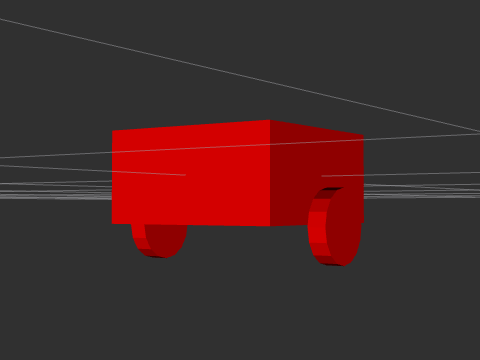

# URDFS or Uniform Resource Definition Files

## Setup

If you haven't done so yet, you need to create a ROS 2 workspace to hold the book code.

```bash
# Do the following if you haven't already created a workspace for this book code.
mkdir -p ~/wr_book_ws/src && cd ~/wr_book_ws/src # Change 'wr_book_ws' if you need a different name or location
git clone git@github.com:wimblerobotics/Robotics_Book.git
cd .. # Should be back at ~/wr_book_ws
colcon build --symlink-install
source install/setup.bash
```

## What is a URDF?

A URDF is a text file that describes a robot's physical structure.
It can be used, for instance, to create a simulated image of what the robot looks like.
It can do more than just that, though, such as provide kinematic properties so that a full,
physics-base simulator can simulate the robot acting and moving in a simulated world.
But at the core, even without simulation, even without visualization, a URDF is primarily
just an easier way to describe how to translate data from one frame of reference to another.

As an example, suppose you have a LIDAR sensor mounted high up on the robot.
And you have a camera mounted about half way on the left side of the robot.
Both the camera and the LIDAR can see an obstacle a bit ahead of the robot.
How is the robot to understand where the obstacle really is so it can issue motor
commands to avoid it? 
It does so by translating the sensor data from the frame of reference of the LIDAR and
the sensor data from the frame of reference of the camera into a common frame
of reference—say that of the very center of the robot.

It's not important that it's the center of the robot, only that the robot can translate any
location-based data from any frame of reference to any other frame of reference.
In ROS, those translations happen using a concept called *transforms*, which are powered
by *frames*, and here comes the punchline, a URDF provides an easy way to define most or
all of the frames of reference in a robot, and ROS does the rest.

For now, think of a URDF as a list of parts, called *links* and a list of descriptions
about how those links are connected, called *joints*.

We will next use a URDF that describes a two wheeled robot with a square body.
We will use the ROS tool *rviz2* to visualize the robot.
We will build on the knowledge of URDF in a few steps, starting with a relatively simple sample and then we
will add more complexity and eventually add in the use of a macro processor to simplify
how you write the description.

## Step 1: The first URDF file

A URDF file is an [XML](https://www.w3schools.com/xml/) file. You can create one using any text editor or with an IDE that makes it easy to create valid XML code. Let's begin with this simple URDF which is in the [1.urdf](../../description/urdf/1.urdf) file.

```xml
<?xml version="1.0"?>
<robot name="simple_robot">
  <link name="base_link">
    <visual>
      <geometry>
        <box size="0.5 0.5 0.25"/>
      </geometry>
      <pose>0 0 0.125 0 0 0</pose>
    </visual>
  </link>
  <link name="left_wheel">
    <visual>
      <geometry>
        <cylinder radius="0.1" length="0.05"/>
      </geometry>
    </visual>
  </link>
  <joint name="wheel_joint" type="continuous">
    <parent link="base_link"/>
    <child link="left_wheel"/>
    <origin xyz="0 -0.29 -0.13" rpy="1.5708 0 0"/>
    <axis xyz="0 1 0"/>
  </joint>
  <link name="right_wheel">
    <visual>
      <geometry>
        <cylinder radius="0.1" length="0.05"/>
      </geometry>
    </visual>
  </link>
  <joint name="right_wheel_joint" type="continuous">
    <parent link="base_link"/>
    <child link="right_wheel"/>
    <origin xyz="0 0.29 -0.13" rpy="1.5708 0 0"/>
    <axis xyz="0 1 0"/>
  </joint>

</robot>
```

To make it easier to understand as I explain what the URDF is describing,
here is what the UDR file looks like using the *rviz2* tool, though the image is only a
slice of what *rviz2* can show, and *rviz2* can do much more than simply visualize this
URDF file:



*

To see the visualization yourself, you can run the following command:

```bash
cd ~/wr_book_ws # Change this if you have a different workspace name
colcon build --symlink-install
source install/setup.bash
ros2 launch description description.launch.py urdf_file_name:="1.urdf"
```

## Explaining 1.urdf

The first line, `<?xml version="1.0"?>`, is the XML declaration.
It tells the parser reading the text file that this is an XML file and what version
of XML it is.

The next line, `<robot name="simple_robot">`, is the start of the robot description.
The `name` attribute is the name of the robot.
The robot description ends with `</robot>` in the last line of the file.

Next come link and joint pairs.
Remember that link elements define real, physical components of the robot and joint elements define how those links are connected. In this case, we have three links: `base_link`, `left_wheel`, and `right_wheel`. We also have two joints: `wheel_joint` and `right_wheel_joint`.

The name `base_link` is chosen because the ROS [rep 105](https://www.ros.org/reps/rep-0105.html)
suggests that the base link should be the name of the link that is fixed to the world. I'll explain what that means later on.

The `base_link` link is a box with dimensions 0.5 x 0.5 x 0.25. The `left_wheel` and `right_wheel` links are cylinders with a radius of 0.1 and a length of 0.05. The `wheel_joint` and `right_wheel_joint` joints connect the `base_link` to the `left_wheel` and `right_wheel` links, respectively. The `wheel_joint` joint is located at the front of the robot, and the `right_wheel_joint` joint is located at the back of the robot.

The `origin` element specifies the position and orientation of the link or joint relative to its parent. The `axis` element specifies the axis of rotation for the joint.

## Step 2: Adding a caster wheel

Now let's add a caster wheel to the robot. The caster wheel will be a sphere that is connected to the back of the robot. Here is the updated URDF file, which is in the [2.urdf](../../description/urdf/2.urdf) file.

```xml
<?xml version="1.0"?>
<robot name="simple_robot">
  <link name="base_link">
    <visual>
      <geometry>
        <box size="0.5 0.5 0.25"/>
      </geometry>
      <pose>0 0 0.125 0 0 0</pose>
    </visual>
  </link>
  <link name="left_wheel">
    <visual>
      <geometry>
        <cylinder radius="0.1" length="0.05"/>
      </geometry>
    </visual>
  </link>
  <joint name="wheel_joint" type="continuous">
    <parent link="base_link"/>
    <child link="left_wheel"/>
    <origin xyz="0 -0.29 -0.13" rpy="1.5708 0 0"/>
    <axis xyz="0 1 0"/>
  </joint>
  <link name="right_wheel">
    <visual>
      <geometry>
        <cylinder radius="0.1" length="0.05"/>
      </geometry>
    </visual>
  </link>
  <joint name="right_wheel_joint" type="continuous">
    <parent link="base_link"/>
    <child link="right_wheel"/>
    <origin xyz="0 0.29 -0.13" rpy="1.5708 0 0"/>
    <axis xyz="0 1 0"/>
  </joint>
  <link name="caster_wheel">
    <visual>
      <geometry>
        <sphere radius="0.1"/>
      </geometry>
    </visual>
  </link>
  <joint name="caster_wheel_joint" type="continuous">
    <parent link="base_link"/>
    <child link="caster_wheel"/>
    <origin xyz="0 0 -0.13" rpy="0 0 0"/>
    <axis xyz="0 0 1"/>
  </joint>
</robot>
```
